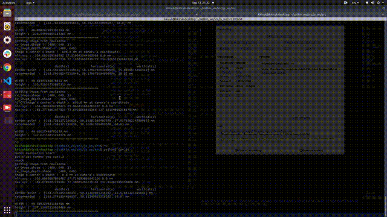

# Segmentation to World Coordinate by FCN and Camera Calibration 

- Grasping Project for Korea University Robot Club, KAsimov.
- Segmentation by Fully Convolutional Network.
    - [Paper Link](https://arxiv.org/abs/1411.4038)
- Backbone by ResNet 18 pretrained on ImageNet.
- Full model is Pretrained on PASCAL VOC 2012.
- Fine tuned on Own dataset, for 3 classes.

# Dependency and Commands to Run

- ROS Noetic
    - [Installation Link](http://wiki.ros.org/noetic/Installation/Ubuntu)
- ROS Wrapper for Intel RealSense
    - [Installation Link](https://github.com/IntelRealSense/realsense-ros)

To start realsense camera package, do this command.

```
source /opt/ros/noetic/setup.bash && source ~/catkin_ws/devel/setup.bash
roslaunch realsense2_camera rs_camera.launch align_depth:=true
```

To start segmentation_to_world package, do this command.

```
source /opt/ros/noetic/setup.bash && source ~/catkin_ws/devel/setup.bash
cd src
python3 cam.py
```

# Result of Metric

- test on PASCAL VOC 2012 validation set
- Accuracy : 88%
- Mean IoU : 42%

# Reference for this repo

- Intrinsic camera calibration
    - [Link](https://learnopencv.com/camera-calibration-using-opencv/)
- Extrinsic camera calibration
    - [Link](https://foss4g.tistory.com/1665)

# Demo Videos

- on Youtube
  - [On Robot](https://youtu.be/znpJGxREoVE)
  - [On Screen 1](https://youtu.be/dAixFD9XThM)
  - [On Screen 2](https://youtu.be/-ozK8xmS2pE)
  - [On Screen 3](https://youtu.be/TB8IPLbE2zM)



